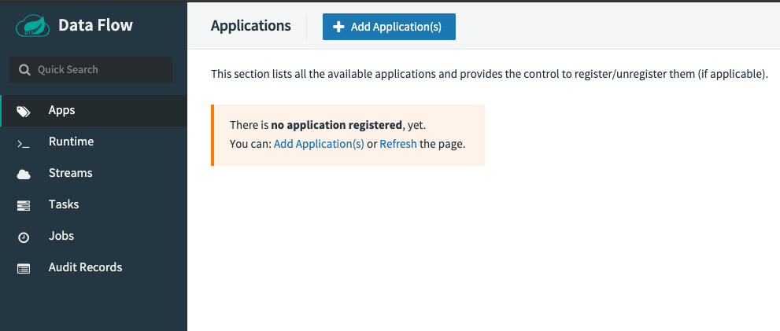

# Deploy a Spring Cloud Task application using Data Flow

In this section, we will demonstrate how to register a Spring Cloud Task application with Data Flow, create a task definiton, and deplot the task to Cloud Foundry, Kubernetes and your local machine.

## Development

For this guide, we will use the [simple task](batch-developer-guides/batch/simple-task) sample Spring Cloud Task application, called `billsetuptask`.
Follow the instructions to code and build the task if you have not done so already.
We will register a task applicaton, create a simple task definition, and launch the task using the Data Flow Server.
The Data Flow Server provides a comprehensive [API](http://docs.spring.io/spring-cloud-dataflow/docs/current/reference/htmlsingle/#api-guide) to perform the necessary steps.
The Data Flow server includes a Data Flow Dashboard web UI client. In addition there is a [Data Flow Shell](http://docs.spring.io/spring-cloud-dataflow/docs/current/reference/htmlsingle/#shell) CLI, available as separate download.
The shell and the UI both expose the complete API functionality.
Which one to use is a matter of preference, but the UI is quite nice so we will feature it here.

### The Data Flow Dashboard

Assuming Data Flow is [installed](installation/) and running on one of the supported platforms, open your browser at `<data-flow-url>/dashboard`. Here, `<data-flow-url>` depends on the platform. Consult the [installation guide](/installation) to determing the base URL for your installation. If Data Flow is running on your local maching, go to http://localhost:9393/dashboard.

### Application Registration

The Data Flow Dashboard will land on the Application Registration page where we will register the sample task.



#### Application Registration Concepts

Applications in Data Flow are registered as named resources so that they may be referenced when using the Data Flow DSL to configure and compose tasks.
Registration associates a logical application name and type with a physical resource, given by a URI.
The URI conforms to a [schema](http://docs.spring.io/spring-cloud-dataflow/docs/current/reference/htmlsingle/#spring-cloud-dataflow-register-stream-apps) and may represent a Maven artifact, a Docker image, or an actual `http(s)` or `file` URL.
Data Flow defines a some logical application types which indicate its role as a streaming component, a task, or a standalone application.
Spring Cloud Task applications, as you might guess, are always registered as a `task` type.

##### Maven Artifacts

The URI for a Maven artifact is of the form `maven://<groupId>:<artifactId>[:<extension>[:<classifier>]]:<version>`.

---

**NOTE**

`classifier` is optional.
The pre-built [stream](http://cloud.spring.io/spring-cloud-stream-app-starters/) and [task/batch](http://cloud.spring.io/spring-cloud-task-app-starters/) applications package application metadata, including property descriptions,in a separate jar file.
In this case, it is common to see the `metadata` classifier to indicate the artifact containing only the metadata.

---

Examples of Maven URIs are:

```
maven://org.springframework.cloud.task.app:timestamp-task:2.1.0.RELEASE
maven://org.springframework.cloud.task.app:timestamp-task:jar:metadata:2.1.0.RELEASE
```

The `maven:` protocol specifies a Maven artifact which is resolved using the remote and local Maven repositories configured for the Data Flow Server.

##### Docker Images

The URI for a Docker Image is of the form `docker:<docker-image-path>/<imageName>:<version>` and is resolved using the Docker registry configured for the Data Flow task platform and image pull policy.

An example of a Docker URI is:

```
docker:springcloudtask/timestamp-task:2.1.0.RELEASE
```

#### Registering an Application

To register an application, select `Add Applications` and `Register one or more applications`. Fill in the form, as shown, and hit `Register the application(s)`.


### Create Stream DSL

how to create the DSL using CLI and/or (?) UI

### Validate Stream DSL

make sure the app coordinates are correct

## Deployment

Deploy to local, Cloud Foundry and Kubernetes

### Local

get the jar run it bla

### Cloud Foundry

As Alana I must ask for an org/space

### Kubernetes

Where all the cool kids play.
