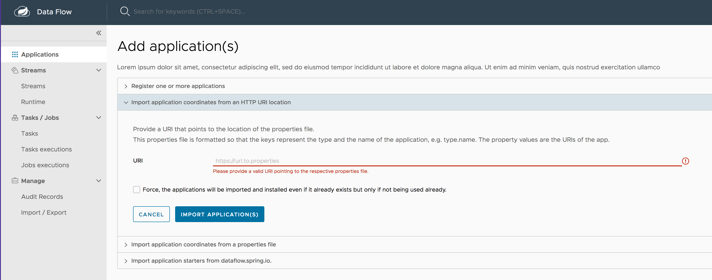

# Pre-packaged Applications (3.x)

<!--TIP-->

This page contains information about the 3.x release `stream-applications` which introduces many new features and some changes which are incompatible with the 2.x release. If you are looking for information about the 2.x release, see [pre-packaged applicattions](%currentPath%/applications/pre-packaged/).

<!--END_TIP-->

The Spring team provides and supports a selection of pre-packaged applications used to assemble various data integration and processing pipelines and to support Spring Cloud Data Flow development, learning and experimentation.

## Getting Started

<!--TIP-->

If you are interested in upgrading existing data pipelines to use `3.x` applications, see the [Migration Guide](%currentPath%/applications/migration).

<!--END_TIP-->

All pre-packaged streaming applications:

- Are available as Apache Maven artifacts or Docker images
- Use RabbitMQ or Apache Kafka
- Support monitoring through [Prometheus](https://prometheus.io/) and [InfluxDB](https://www.influxdata.com/)
- Contain metadata for application properties used in the UI and code completion in the shell

You can register stream and task applications by using the Data Flow UI or the shell.

You can register applications individually by using the `app register` command or in bulk by using the `app import` command.

For streams, depending on whether you use Kafka or RabbitMQ, you can register the applications by using the respective URLs:

- Kafka

* Docker: https://dataflow.spring.io/kafka-docker-milestone
* Maven: https://dataflow.spring.io/kafka-maven-milestone

- RabbitMQ

* Docker: https://dataflow.spring.io/rabbitmq-docker-milestone
* Maven: https://dataflow.spring.io/rabbitmq-maven-milestone

Using the Data Flow UI, these links are included for pre-fill:



From the Data Flow Shell, you can bulk import and register the applications, as the following example shows:

```bash
dataflow:>app import --uri https://dataflow.spring.io/kafka-maven-milestone
```

## Stream Applications

The Spring team develops and maintains [stream applications](https://spring.io/projects/spring-cloud-stream-applications#learn) and publishes these applications to the [Spring public Maven repository](https://repo.spring.io/release/org/springframework/cloud/stream/app/) and to [Dockerhub](https://hub.docker.com/u/springcloudstream) in accordance with a release schedule, normally following significant Spring Boot or Spring Cloud Stream releases.
The pre-packaged stream applications are Spring Boot executable jars that are built with a specific binder implementation.
For each stream app, we provide separate exacutable applications for RabbitMQ and Kafka.

Currently available stream applications include:

| Source                                                                                              | Processor                                                                                                          | Sink                                                                                              |
| --------------------------------------------------------------------------------------------------- | ------------------------------------------------------------------------------------------------------------------ | ------------------------------------------------------------------------------------------------- |
| [cdc-debezium](%stream-applications-doc-3x%/#spring-cloud-stream-modules-cdc-debezium-source)       | [aggregator](%stream-applications-doc-3x%/#spring-cloud-stream-modules-aggregator-processor)                       | [cassandra](%stream-applications-doc-3x%/#spring-cloud-stream-modules-cassandra-sink)             |
| [file](%stream-applications-doc-3x%/#spring-cloud-stream-modules-file-source)                       | [bridge](%stream-applications-doc-3x%/#spring-cloud-stream-modules-bridge-processor)                               | [analytics](%stream-applications-doc-3x%/#spring-cloud-stream-modules-analytics-sink)             |
| [ftp](%stream-applications-doc-3x%/#spring-cloud-stream-modules-ftp-source)                         | [filter](%stream-applications-doc-3x%/#spring-cloud-stream-modules-filter-processor)                               | [wavefront](%stream-applications-doc-3x%/#spring-cloud-stream-modules-wavefront-sink)             |
| [geode](%stream-applications-doc-3x%/#spring-cloud-stream-modules-geode-source)                     | [groovy](%stream-applications-doc-3x%/#spring-cloud-stream-modules-groovy-processor)                               | [file](%stream-applications-doc-3x%/#spring-cloud-stream-modules-file-sink)                       |
| [http](%stream-applications-doc-3x%/#spring-cloud-stream-modules-http-source)                       | [header-enricher](%stream-applications-doc-3x%/#spring-cloud-stream-modules-header-enricher-processor)             | [ftp](%stream-applications-doc-3x%/#spring-cloud-stream-modules-ftp-sink)                         |
| [jdbc](%stream-applications-doc-3x%/#spring-cloud-stream-modules-jdbc-source)                       | [http-request](%stream-applications-doc-3x%/#spring-cloud-stream-modules-http-request-processor)                   | [geode](%stream-applications-doc-3x%/#spring-cloud-stream-modules-geode-sink)                     |
| [jms](%stream-applications-doc-3x%/#spring-cloud-stream-modules-jms-source)                         | [image-recognition](%stream-applications-doc-3x%/#spring-cloud-stream-modules-image-recognition-processor)         | [jdbc](%stream-applications-doc-3x%/#spring-cloud-stream-modules-jdbc-sink)                       |
| [load-generator](%stream-applications-doc-3x%/#spring-cloud-stream-modules-load-generator-source)   | [object-detection](%stream-applications-doc-3x%/#spring-cloud-stream-modules-object-detection-processor)           | [log](%stream-applications-doc-3x%/#spring-cloud-stream-modules-log-sink)                         |
| [mail](%stream-applications-doc-3x%/#spring-cloud-stream-modules-mail-source)                       | [semantic-segmentation](%stream-applications-doc-3x%/#spring-cloud-stream-modules-semantic-segmentation-processor) | [mongodb](%stream-applications-doc-3x%/#spring-cloud-stream-modules-mongodb-sink)                 |
| [mongodb](%stream-applications-doc-3x%/#spring-cloud-stream-modules-mongodb-source)                 | [script](%stream-applications-doc-3x%/#spring-cloud-stream-modules-script-processor)                               | [mqtt](%stream-applications-doc-3x%/#spring-cloud-stream-modules-mqtt-sink)                       |
| [mqtt](%stream-applications-doc-3x%/#spring-cloud-stream-modules-mqtt-source)                       | [splitter](%stream-applications-doc-3x%/#spring-cloud-stream-modules-splitter-processor)                           | [pgcopy](%stream-applications-doc-3x%/#spring-cloud-stream-modules-pgcopy-sink)                   |
| [rabbit](%stream-applications-doc-3x%/#spring-cloud-stream-modules-rabbit-source)                   | [transform](%stream-applications-doc-3x%/#spring-cloud-stream-modules-transform-processor)                         | [rabbit](%stream-applications-doc-3x%/#spring-cloud-stream-modules-rabbit-sink)                   |
| [s3](%stream-applications-doc-3x%/#spring-cloud-stream-modules-s3-source)                           | [twitter-trend](%stream-applications-doc-3x%/#spring-cloud-stream-modules-twitter-trend-processor)                 | [redis](%stream-applications-doc-3x%/#spring-cloud-stream-modules-redis-sink)                     |
| [sftp](%stream-applications-doc-3x%/#spring-cloud-stream-modules-sftp-source)                       |                                                                                                                    | [router](%stream-applications-doc-3x%/#spring-cloud-stream-modules-router-sink)                   |
| [syslog](%stream-applications-doc-3x%/#spring-cloud-stream-modules-syslog-source)                   |                                                                                                                    | [rsocket](%stream-applications-doc-3x%/#spring-cloud-stream-modules-rsocket-sink)                 |
| [tcp](%stream-applications-doc-3x%/#spring-cloud-stream-modules-tcp-source)                         |                                                                                                                    | [s3](%stream-applications-doc-3x%/#spring-cloud-stream-modules-s3-sink)                           |
| [time](%stream-applications-doc-3x%/#spring-cloud-stream-modules-time-source)                       |                                                                                                                    | [sftp](%stream-applications-doc-3x%/#spring-cloud-stream-modules-sftp-sink)                       |
| [twitter-message](%stream-applications-doc-3x%/#spring-cloud-stream-modules-twitter-message-source) |                                                                                                                    | [tasklauncher](%stream-applications-doc-3x%/#spring-cloud-stream-modules-tasklauncher-sink)       |
| [twitter-search](%stream-applications-doc-3x%/#spring-cloud-stream-modules-twitter-search-source)   |                                                                                                                    | [tcp](%stream-applications-doc-3x%/#spring-cloud-stream-modules-tcp-sink)                         |
| [twitter-stream](%stream-applications-doc-3x%/#spring-cloud-stream-modules-twitter-stream-source)   |                                                                                                                    | [throughput](%stream-applications-doc-3x%/#spring-cloud-stream-modules-throughput-sink)           |
| [websocket](%stream-applications-doc-3x%/#spring-cloud-stream-modules-websocket-source)             |                                                                                                                    | [twitter-message](%stream-applications-doc-3x%/#spring-cloud-stream-modules-twitter-message-sink) |
|                                                                                                     |                                                                                                                    | [twitter-update](%stream-applications-doc-3x%/#spring-cloud-stream-modules-twitter-update-sink)   |
|                                                                                                     |                                                                                                                    | [websocket](%stream-applications-doc-3x%/#spring-cloud-stream-modules-websocket-sink)             |

# Bulk Registration of Stream Applications

Spring Cloud Data Flow supports bulk registration of applications, via a standard properties file format.
For convenience, we publish static properties files with application-URIs (for either maven or docker) for all the out-of-the-box stream and task/batch apps.
You can use these files in Spring Cloud Data Flow to register all the application-URIs in bulk.
Alternately, you can register them individually or provide your own custom property file with only the required application-URIs in it.
Bulk registration is convenient for getting started with SCDF.
To reduce clutter, it is recommended, to maintain a “focused” list of desired application-URIs in a custom property file.
